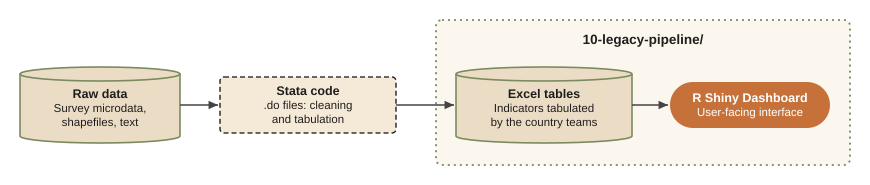
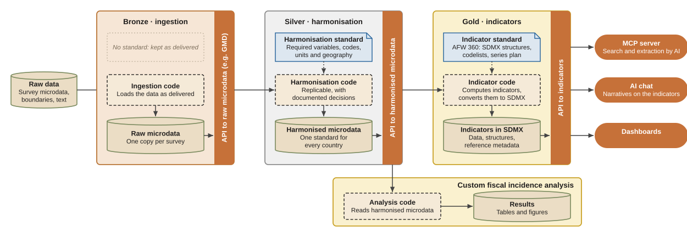

# Introduction

This page is the map of the whole (ideal) process of data transformation for
the Africa West 360 (AFW360) project. The goal of AFW360 is to operationalize
microdata for daily use by country economists and analysts through:

1. enabling access to the raw microdata as is using an API.
2. harmonizing microdata with clear harmonization guidelines and data provenance and enabling API-based access to it.
3. creating a reproducible pipeline of indicators creation from the harmonized microdata and enabling access to those through an API.
4. making indicators operational for humans and AI through a dashboard, a data access MCP server, and AI chats.

This is a concept note with a few prototypes to prove the concept.

## Where we have started

Our starting point is a set of Excel files produced from the raw data. It gives an
overview of a fragment of the pipeline as well as the initial version of the
dashboard developed by Moritz Meyer and published here: <https://datanalytics-int.worldbank.org/AFW360-v1/>
(requires VPN to access). Original data and dashboard code are located in the
folder `10-legacy-pipeline/`. @fig-legacy-pipeline shows how they connect.

{#fig-legacy-pipeline}

## Where are we going

Our goal is to create a sustainable data transformation pipeline, where data
provenance is transparent and the produced indicators are accessible to machines
and humans and could be operationalized in the future as:

1. statistical data,
2. an API,
3. an MCP server for search and extraction by AI,
4. a basis for AI processing and for building stories based on the data.

@fig-ideal-pipeline shows the ideal pipeline: a medallion-style (Bronze, Silver,
Gold) ETL (extract, transform, load) pipeline. It is designed to be modular, with
each stage building on the previous one.

{#fig-ideal-pipeline}

**Bronze.** Raw microdata ingestion and operationalization through an
API-like sustainable access interface. The World Bank (WB) has several systems
for this, each with its own strengths and limitations. The main ones are:

- **Development Data Hub**: <https://datacatalog.worldbank.org/>. This appears to
  be the best of the available options. It permits hosting data in individual
  files without the need for deep standardization, gives access to the data
  through streamable APIs and integrates directly with Databricks and other data
  storage platforms. It is the way of publishing data for analysis recommended
  by the [WB reproducibility team](https://worldbank.github.io/wb-reproducible-research-repository/guidance_note_wb.html).

- **World Bank Microdata Library**: <https://microdatalib.worldbank.org/index.php/home>.
  This is another option used to disseminate microdata. Its key limitation is
  that it requires exhaustive preparation of the data and metadata, which is
  costly. As a result, its coverage is patchy, and data are often available
  only as incomplete data sets.

- **Datalibweb**: <https://datalibweb2.worldbank.org/home>. A Stata-native system
  designed for hosting and serving the Global Monitoring Database (GMD). It
  benefits from granular access control, but the way it serves data to users is
  restrictive and is harder to use outside Stata.

**Silver.** Harmonization of microdata into a common format, with clear
documentation of the harmonization decisions and a reproducible data pipeline.
This stage establishes a shared harmonization standard across countries and
regions and enables API-based dissemination of the harmonized data. As a
dissemination platform, the Development Data Hub could be used again, or the
World Bank Microdata Library could share the harmonized data with standard
documentation, in the same way as the Global Labor Database (GLD) is shared:
<https://microdatalib.worldbank.org/index.php/catalog/GLD/>

**Gold.** Production of indicators in a standard SDMX format in a fully
reproducible manner that enables data access for the final users.

There are a few concepts here worth exploring:

1. **SDMX** (Statistical Data and Metadata eXchange): a standard for
   [statistical data and metadata exchange](https://sdmx.org/). It is widely
   used in the international statistical community and supported by many
   statistical software packages and visualization tools. It is the standard
   behind WDI, OECD Stats, Data 360 and other data dissemination platforms. It
   matters because it makes data provenance transparent and reproducible and
   communicates clearly what the computed indicators and data are.

2. **SDMX data files**: access to SDMX data is simple for analysts. Each
   country, survey and year is represented as a single CSV file with supporting
   metadata. Users load it into their statistical software and start working
   with it. These files could be hosted on the Microdata Library or the
   Development Data Hub.

3. **API**: an API is the standard way to access SDMX-based data because it
   gives every user (people, statistical software and so on) the same interface
   for reading and loading data. One example is the Data 360 API
   <https://data360.worldbank.org/en/int/api>. Type
   <https://data360api.worldbank.org/data360/indicators?datasetId=WB_WDI> in the
   browser and you will get the full list of indicators available in the WDI database.

4. **MCP server** (Model Context Protocol server): software that lets local or
   remote AI agents communicate with the API and extract data from it. It is
   what connects any AI agent to the data and metadata. Data 360 introduces its
   MCP server here: <https://worldbank.github.io/data360-mcp/>, and it is used
   across AI agents. It is open source and could be adopted at low cost.
   MCP servers are powerful because they can be integrated into the World Bank's
   internal AI chats, mAI and k360, enabling data exploration augmented by
   access to WB knowledge and internal documentation.

5. **AI chat**: probably the final stage of the process. It operationalizes AI
   to answer development questions based on the data and metadata available for
   the region in SDMX format. One prototype is
   <https://data360.worldbank.org/en/int/chat>; another is
   <https://k360.worldbankgroup.org/> (requires VPN to access). Both use a set
   of MCP servers to access relevant information. They use AI to rephrase the
   questions (prompt engineering) so that they retrieve the most relevant data
   and structure the answers well.

6. **Dashboards**: the human-oriented interface to the data. Having data
   structured as an SDMX database with an API enables any dashboard to be built
   on top of it and deployed through channels such as Power BI, Tableau and
   R Shiny.

7. **Supporting knowledge**: a key element of a successful and relevant data
   pipeline. For AI to give relevant, data-supported answers to development
   questions, it needs to know how to reason. This is why a hierarchy of
   supporting knowledge is important: the development questions, the data and
   the metadata. It gives AI correct references and templates for reasoning,
   for exploring the data and for writing the answer. In practice, this
   knowledge is structured plain text organized so that AI can use it, e.g.
   AI Skills.

This pipeline could be implemented in any statistical software, but its
advantages show most in a scalable working environment such as Databricks.
We could also borrow implementation best practices from the GLD.

# Implementing AFW360 data pipeline

It is a challenge that requires commitment and investment. Yet modern AI tools
make it more feasible than it used to be. The following steps
are proposed to implement the pipeline:

- Step 0: Verify that the legacy pipeline (Excel-Dashboard) is working and could be used as a reference for the new pipeline
- Step 1: Reverse engineer Silver-Gold: convert existing Excel files into SDMX-based data
- Step 2: Establish an SDMX Data Structure Definition (DSD) for our indicators
- Step 3: Validate that Excel-based indicators after transformation follow the DSD standard
- Step 4: Build a process of expanding indicators and data coverage
- Step 5: Micro-data harmonization and indicators computation Bronze-Silver medallions
- Step 6: APIs to the indicators data
- Step 7: Knowledge base for AI to use
- Step 8: MCP server for AFW360 data
- Step 9: Dedicated AI chat that operationalizes data and knowledge

## Implementation tracking

| Step | Short description | Status |
|---|---|---|
| 0 | Verify the legacy Excel-to-dashboard pipeline as a reference | Planned |
| 1 | Reverse engineer Silver-to-Gold: convert existing Excel files into SDMX-based data | Planned |
| 2 | Establish an SDMX Data Structure Definition (DSD) for the indicators | Planned |
| 3 | Validate transformed Excel-based indicators against the DSD | Planned |
| 4 | Build a process to expand indicator and data coverage | Planned |
| 5 | Harmonize microdata and compute indicators (Bronze-to-Silver stages) | Planned |
| 6 | Provide APIs for indicator data | Planned |
| 7 | Build a knowledge base for AI | Planned |
| 8 | Build an MCP server for AFW360 data | Planned |
| 9 | Launch a dedicated AI chat using the data and knowledge | Planned |

The process starts from Gold and works back to Bronze because the dashboard and
its Excel tables already exist. Converting them to SDMX first (Steps 1–3) forces
a precise definition of the indicators and their structure, the DSD. The DSD
then becomes the target that the harmonized microdata (Step 5) must feed, so
the upstream stages are built against a known output rather than in the abstract.

All steps are explained in the respective documents:

TODO.
