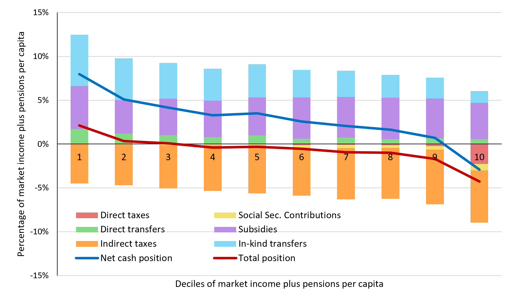

<!-- 

IDEAS TO BE IMPLEMENTED

1/ include map instead of table (include squares for number of poor) >> using geopanda
2/ show multiple years for Summary 
3/ adjust % versus #; and adjust format of numbers #.#
4/ organize country specific elements via a loop (only file_path, Messages annd shapefiles are country specific)
5/ Edit Messages and Text. Consider using boxes for stylized facts
6/ Do we want to include an international comparison

AND: make code more efficient by splitting functions from design
AND: discuss how this can be hosted within WBG infrastructure
AND: set up better folder infrastructure
AND: allow for download of tables and figures
AND: add indicators in fiscal equity (from FIA global database)

PLUS: do we want to facilitate multi year comparison
PLUS: advance text fields for Key Messages and About
PLUS: alignment with PEB and MPO
PLUS: how to create synergies between dashboard and pdf, doc(x)
-->


```{python}

# STEP 1: Import global packages

from pathlib import Path

import matplotlib.pyplot as plt
import numpy as np

from IPython.display import Markdown

from IPython.display import HTML
import base64

import pandas as pd
#import geopandas as gpd
import matplotlib.pyplot as plt


# STEP 2: Define Tables for Profile 

# Define indicators to keep and rename and Reorder rows and columns
group_map_Profile = {
    "estimateTotal": "Total",
    "estimateFemale_HH": "Female",
    "estimateMale_HH": "Male",
    "estimateYouth_HH": "Youth",
    "estimateOlder_HH": "29+", "estimateQ1" : "Q1", "estimateQ2" : "Q2", "estimateQ3" : "Q3", "estimateQ4" : "Q4",	"estimateQ5" : "Q5",
    "estimateRural": "Rural",
    "estimateCapital": "Capital",
    "estimateOther_Urban": "Other Urban"
}
col_order_Profile =  ["Total", "Female", "Male", "Youth", "29+", "Q1", "Q2", "Q3", "Q4", "Q5", "Rural", "Capital", "Other Urban"]

indicator_map_Welfare = {
    "Food consumption share": "Food consumption share",
    "Own-production food share (% total cons.)": "Own-production food consumption",
    "Market food share (% total cons.)": "Market food consumption",
    "Non-food consumption share": "Non-food consumption share",
    "Employed in agriculture (% of employed)": "Share employed in agriculture",
    "Employed in industry (% of employed)": "Share employed in industry",
    "Employed in services (% of employed)": "Share employed in services"
}
row_order_Welfare = [
    "Food consumption share",
    "Own-production food consumption",
    "Market food consumption",
    "Non-food consumption share",
    "Share employed in agriculture",
    "Share employed in industry",
    "Share employed in services"
]

indicator_map_Jobs = {
    "Employed (activ12m, 15–64)": "Employment rate",
    "Wage-employed (% of employed)": "Wage employment rate",
    "Share of HH workers informally employed": "Informal wage employment (% of wage)",
    "Non-wage employed (% of employed)": "Non-wage employment rate",
    "HH owns a non-agric enterprise": "Non-agric. enterprise ownership rate",
    "Exposed to any shock (past 3 years)": "Shock exposure rate (any shock, 3 yrs)"
}
row_order_Jobs = [
    "Employment rate",
    "Wage employment rate",
    "Informal wage employment (% of wage)",
    "Non-wage employment rate",
    "Non-agric. enterprise ownership rate",
    "Shock exposure rate (any shock, 3 yrs)"
]

indicator_map_Agri = {
    "HH cultivates agricultural land (superf > 0)": "Agricultural participation rate"
}
row_order_Agri = [
    "Agricultural participation rate",
    "Improved seed use rate",
    "Fertilizer use rate",
    "Market orientation rate",
    "Agricultural mechanisation index"
]

indicator_map_Energy = {
    "Access to electricity (grid, SDG 7.1.1)": "Access to electricity (grid or off-grid)",
    "Primary cooking fuel clean (gas/electricity)": "Clean cooking fuel access rate",
    "Primary cooking fuel biomass (wood/charcoal)": "Solid biomass dependency rate"
}
row_order_Energy = [
    "Access to electricity (grid or off-grid)",
    "Clean cooking fuel access rate",
    "Solid biomass dependency rate",
    "Energy expenditure burden"
]

# STEP 3: Define Style for Tables

def style_table(table):
    return (
        table.style
        .format("{:.0%}")  # show percentages in format %.%
        .set_properties(**{
            "font-family": "Calibri, Arial, sans-serif",
            "font-size": "11pt",
            "text-align": "center"
        })
        .set_table_styles([
            {
                "selector": "th",
                "props": [
                    ("font-size", "11pt"),
                    ("text-align", "center"),
                    ("background-color", "#f2f2f2")
                ]
            }
        ])
    )


# STEP 4: Create option to download Figures and Tables

def download_figure(fig, filename="figure.png"):
    import io
    buf = io.BytesIO()
    fig.savefig(buf, format="png", dpi=300, bbox_inches="tight")
    buf.seek(0)
    
    st.download_button(
        label="Download figure",
        data=buf,
        file_name=filename,
        mime="image/png"
    )

def download_table(df, filename="table.xlsx"):
    import io
    buf = io.BytesIO()
    df.to_excel(buf, index=False, engine="openpyxl")
    buf.seek(0)
    
    st.download_button(
        label="Download table",
        data=buf,
        file_name=filename,
        mime="application/vnd.openxmlformats-officedocument.spreadsheetml.sheet"
    )
```


# Senegal

```{python}
# Load Excel file
file_path = "INPUT Tables/Tables_SEN.xlsx"
```

## Row Messages {height=10%}

```{python}
#| title: <b>Poverty Patterns and Trends</b>
Markdown("<span style='font-size:16px;'>In 2026, stronger economic activity and easing inflation are expected to reduce poverty to ## percent, leaving over ## million people below the $4.20/day (2021 PPP) line. Growth has been driven in part by hydrocarbons, but employment gains remain limited, as mining and extractives employ few workers. By contrast, favorable rainfall and sustained agricultural growth are expected to raise incomes among poorer households.</span>")
```

```{python}
#| title: <b>Drivers of Inequality</b>
Markdown("<span style='font-size:16px;'> Persistent spatial disparities between Dakar and other regions and unequal access to services, economic opportunities, and overlapping deficits in income and human development shape inequality (Gini: ##). Poverty rates are higher in rural areas (## percent), where most poor households rely on agriculture, while in urban areas (## percent), poverty is concentrated in low-productivity informal services. Despite lower poverty rates, the large populations in Thiès and Diourbel imply that a substantial share of the poor resides in urban areas.</span>")
```

```{python}
#| title: <b>Constraints to Inclusive Growth</b>
Markdown("<span style='font-size:16px;'>Inclusive growth remains constrained by low human capital, infrastructure gaps, and limited access to productive jobs, keeping many households in low-productivity agriculture and informal activities. Spatial disparities and weak market integration further limit participation in growth, particularly in rural and lagging areas. External pressures—including climate shocks, regional instability, and youth outmigration—amplify these constraints and undermine resilience.</span>")
```


## Row International Poverty {height=5%}

```{python}
#| title: International Poverty Rate - $3.00/day PPP 2021

# Read the National sheet
df = pd.read_excel(file_path, sheet_name="National")

# Define the indicators to extract
indicators = {
    "Poor at $3.00/day (2021 PPP)": "Poverty rate",
    "Number poor $3.00/day (millions)": "Number poor (millions)"
}

# Define the geographic columns to keep
geo_cols = {
    "estimateTotal": "Total",
    "estimateCapital": "Capital",
    "estimateOther_Urban": "Other urban",
    "estimateRural": "Rural"
}

# Filter to selected indicators and columns
table = (
    df[df["indicator"].isin(indicators.keys())]
    .loc[:, ["indicator"] + list(geo_cols.keys())]
    .copy()
)

# Rename rows and columns
table["indicator"] = table["indicator"].map(indicators)
table = table.rename(columns=geo_cols)

# Set indicator as row index
table = table.set_index("indicator")

# Optional: reorder rows
row_order = [
    "Poverty rate",
    "Number poor (millions)"
]

table = table.loc[row_order]

# Optional: reorder columns
table = table[["Total", "Capital", "Other urban", "Rural"]]

# Convert poverty rates to percent
table_formatted = table.copy()
rate_rows = table_formatted.index.str.contains("Poverty rate")

# Apply to your table
table_formatted.loc[rate_rows] = table_formatted.loc[rate_rows]
table_formatted = table_formatted.round(1)
styled_table = style_table(table_formatted)
styled_table

```


```{python}
#| title: Lower Middle Income Poverty Rate - $4.20/day PPP 2021

# Read the National sheet
df = pd.read_excel(file_path, sheet_name="National")

# Define the indicators to extract
indicators = {
    "Poor at $4.20/day (2021 PPP)": "Poverty rate",
    "Number poor $4.20/day (millions)": "Number poor (millions)"
}

# Define the geographic columns to keep
geo_cols = {
    "estimateTotal": "Total",
    "estimateCapital": "Capital",
    "estimateOther_Urban": "Other urban",
    "estimateRural": "Rural"
}

# Filter to selected indicators and columns
table = (
    df[df["indicator"].isin(indicators.keys())]
    .loc[:, ["indicator"] + list(geo_cols.keys())]
    .copy()
)

# Rename rows and columns
table["indicator"] = table["indicator"].map(indicators)
table = table.rename(columns=geo_cols)

# Set indicator as row index
table = table.set_index("indicator")

# Optional: reorder rows
row_order = [
    "Poverty rate",
    "Number poor (millions)"
]

table = table.loc[row_order]

# Optional: reorder columns
table = table[["Total", "Capital", "Other urban", "Rural"]]

# Convert poverty rates to percent
table_formatted = table.copy()
rate_rows = table_formatted.index.str.contains("Poverty rate")

# Apply to your table
table_formatted.loc[rate_rows] = table_formatted.loc[rate_rows]
table_formatted = table_formatted.round(1)
styled_table = style_table(table_formatted)
styled_table
```

## Row Figures and Maps {height=10%}

```{python}
##| title: Poverty by Region - $4.20/day (2021 PPP)
#
## Load Excel file and ADM 1 sheet
#df = pd.read_excel(file_path, sheet_name="ADM 1")
#
## Select the row for the indicator of interest
#row = df[df["indicator"] == "Poor at $4.20/day (2021 PPP)"]
#
## Extract location columns (all columns except 'indicator')
#values = row.drop(columns=["indicator"]).iloc[0]
#
## Clean location names (remove 'estimate' prefix)
#values.index = values.index.str.replace("estimate", "")
#
## Convert to DataFrame for plotting
#plot_df = values.reset_index()
#plot_df.columns = ["Location", "Value"]
#
## Sort values for better visualization
#plot_df = plot_df.sort_values(by="Value", ascending=True)
#
## Create horizontal bar chart
#plt.figure(figsize=(10, 6))
#plt.barh(plot_df["Location"], plot_df["Value"], color="steelblue")
#plt.grid(axis="x", linestyle="--", alpha=0.7)
#plt.tight_layout()
#
#plt.show()
```

```{python}
#| title: Poverty by Region - $4.20/day (2021 PPP)

import re
import unicodedata
from pathlib import Path

import geopandas as gpd
import pandas as pd
import matplotlib.pyplot as plt

base_dir = Path(".")
file_path = base_dir / "INPUT Tables" / "Tables_SEN.xlsx"
shp_path = base_dir / "INPUT shp" / "sen_admin1.shp"


def clean_region_name(x):
    x = str(x)
    x = x.replace("estimate", "")
    x = x.replace("_", " ")
    x = x.replace("-", " ")
    x = unicodedata.normalize("NFKD", x).encode("ascii", "ignore").decode("utf-8")
    x = re.sub(r"[^A-Za-z0-9 ]+", " ", x)
    return x.upper().strip()


df = pd.read_excel(file_path, sheet_name="ADM 1", engine="openpyxl")
indicator = "Poor at $4.20/day (2021 PPP)"
row = df[df["indicator"] == indicator].iloc[0]

# Reshape the Excel table into a long-format data frame
values = row.drop(labels=["indicator"]).copy()
df_long = pd.DataFrame({
    "region": values.index,
    "poverty_rate": values.values,
})
df_long["region"] = df_long["region"].map(clean_region_name)
df_long["poverty_rate"] = df_long["poverty_rate"] * 100

# Read the Senegal ADM1 boundaries and align names with the Excel labels
gdf = gpd.read_file(shp_path)[["adm1_name", "geometry"]].copy()
gdf["region"] = gdf["adm1_name"].map(clean_region_name)

# Merge and plot
gdf_map = gdf.merge(df_long, on="region", how="left")

fig, ax = plt.subplots(1, 1, figsize=(10, 10))
gdf_map.plot(
    column="poverty_rate",
    cmap="Reds",
    linewidth=0.8,
    edgecolor="black",
    legend=False,
    ax=ax,
)

# Add labels for each polygon
for idx, row in gdf_map.iterrows():
    centroid = row.geometry.centroid
    ax.annotate(
        text=f"{row['poverty_rate']:.0f}%",
        xy=(centroid.x, centroid.y),
        ha="center",
        va="center",
        fontsize=9,
        fontweight="bold",
        color="black",
    )

ax.set_title("Senegal – Poverty at $4.20/day (2021 PPP), ADM1 level")
ax.axis("off")
plt.tight_layout()
plt.show();

```

```{python}
#| title: Poverty by Agro-Ecological Zone ($4.20/day (2021 PPP))

# Load Excel file and ZAE sheet
df = pd.read_excel(file_path, sheet_name="ZAE")

# Select the row for the indicator of interest
row = df[df["indicator"] == "Poor at $4.20/day (2021 PPP)"]

# Extract location columns (all columns except 'indicator')
values = row.drop(columns=["indicator"]).iloc[0]

# Clean location names (remove 'estimate' prefix)
values.index = values.index.str.replace("estimate", "")

# Convert to DataFrame for plotting
plot_df = values.reset_index()
plot_df.columns = ["Location", "Value"]

# Sort values for better visualization
plot_df = plot_df.sort_values(by="Value", ascending=True)

# Create horizontal bar chart
plt.figure(figsize=(10, 6))
plt.barh(plot_df["Location"], plot_df["Value"], color="orange")
plt.grid(axis="x", linestyle="--", alpha=0.7)
plt.tight_layout()

plt.show()
```


## Row Profile {height=10%}

### Column {.tabset}

```{python}
#| title: Consumption and Income

# Load Excel file
df = pd.read_excel(file_path, sheet_name="National")

# Filter to selected welfare indicators
table = (
    df[df["indicator"].isin(indicator_map_Welfare.keys())]
    .loc[:, ["indicator"] + list(group_map_Profile.keys())]
    .copy()
)

# Rename rows and columns
table["indicator"] = table["indicator"].map(indicator_map_Welfare)
table = table.rename(columns=group_map_Profile)

# Set indicators as rows
table = table.set_index("indicator")

# Apply to your table
table = table.loc[row_order_Welfare, col_order_Profile]
table_formatted = (table).round(1)
styled_table = style_table(table_formatted)
styled_table
```


```{python}
#| title: Jobs

# Load Excel file
df = pd.read_excel(file_path, sheet_name="National")

# Filter to selected welfare indicators
table = (
    df[df["indicator"].isin(indicator_map_Jobs.keys())]
    .loc[:, ["indicator"] + list(group_map_Profile.keys())]
    .copy()
)

# Rename rows and columns
table["indicator"] = table["indicator"].map(indicator_map_Jobs)
table = table.rename(columns=group_map_Profile)

# Set indicators as rows
table = table.set_index("indicator")

# Apply to your table
table = table.loc[row_order_Jobs, col_order_Profile]
table_formatted = (table).round(1)
styled_table = style_table(table_formatted)
styled_table
```


```{python}
#| title: Agriculture

# Load Excel file
df = pd.read_excel(file_path, sheet_name="National")

# Filter available indicators
table = (
    df[df["indicator"].isin(indicator_map_Agri.keys())]
    .loc[:, ["indicator"] + list(group_map_Profile.keys())]
    .copy()
)

# Rename
table["indicator"] = table["indicator"].map(indicator_map_Agri)
table = table.rename(columns=group_map_Profile)

# Set rows
table = table.set_index("indicator")

# Add missing rows explicitly (as NaN placeholders)
missing_rows = [
    "Improved seed use rate",
    "Fertilizer use rate",
    "Market orientation rate",
    "Agricultural mechanisation index"
]

for row in missing_rows:
    table.loc[row] = pd.NA

# Apply to your table
table = table.loc[row_order_Agri, col_order_Profile]
table_formatted = (table).round(1)
styled_table = style_table(table_formatted)
styled_table
```


```{python}
#| title: Energy

# Load Excel file
df = pd.read_excel(file_path, sheet_name="National")

# Filter available indicators
table = (
    df[df["indicator"].isin(indicator_map_Energy.keys())]
    .loc[:, ["indicator"] + list(group_map_Profile.keys())]
    .copy()
)

# Rename rows and columns
table["indicator"] = table["indicator"].map(indicator_map_Energy)
table = table.rename(columns=group_map_Profile)

# Set row index
table = table.set_index("indicator")

# Add missing row (not available in National sheet)
table.loc["Energy expenditure burden"] = pd.NA

# Apply to your table
table = table.loc[row_order_Energy, col_order_Profile]
table_formatted = (table).round(1)
styled_table = style_table(table_formatted)
styled_table
```

```{python}
#| title: Fiscal Equity

# Load Excel file
df = pd.read_excel(file_path, sheet_name="National")

group_map_ProfileFiscal = {
    "estimateTotal": "Total"
}
col_order_ProfileFiscal =  ["Total"]

indicator_map_Fiscal = {
    "Aggregate impact of fiscal policy (Gini change)": "Aggregate impact of fiscal policy (Gini change)",
    "Absolute incidence – subsidies": "Absolute incidence – subsidies",
    "Absolute incidence – social spending": "Absolute incidence – social spending",
    "Absolute incidence – direct taxes": "Absolute incidence – direct taxes",
    "Absolute incidence – indirect taxes": "Absolute incidence – indirect taxes"
}

row_order_Fiscal = [
    "Aggregate impact of fiscal policy (Gini change)",
    "Absolute incidence – subsidies",
    "Absolute incidence – social spending",
    "Absolute incidence – direct taxes",
    "Absolute incidence – indirect taxes"
]


# Filter available indicators
table = (
    df[df["indicator"].isin(indicator_map_Fiscal.keys())]
    .loc[:, ["indicator"] + list(group_map_ProfileFiscal.keys())]
    .copy()
)

# Rename rows and columns
table["indicator"] = table["indicator"].map(indicator_map_Fiscal)
table = table.rename(columns=group_map_ProfileFiscal)

# Set row index
table = table.set_index("indicator")

# Add missing row (not available in National sheet)
table.loc["Aggregate impact of fiscal policy (Gini change)"] = pd.NA
table.loc["Absolute incidence – subsidies"] = pd.NA
table.loc["Absolute incidence – social spending"] = pd.NA
table.loc["Absolute incidence – direct taxes"] = pd.NA
table.loc["Absolute incidence – indirect taxes"] = pd.NA

# Apply to your table
table = table.loc[row_order_Fiscal, col_order_ProfileFiscal]
table_formatted = (table).round(1)
styled_table = style_table(table_formatted)
styled_table
```


## Fiscal Equity {height=10%}

::: {.card}
## Fiscal Equity I - Who pays & Who receives

{width=100%}
_Note: The figure shows the relative incidence of taxes, transfers, and subsidies across the welfare distribution. Source: CEQ/GamSim simulations based on EHCVM._
:::

::: {.card}
## Fiscal Equity II - Who pays & Who receives

{width=100%}
_Note: The figure shows the absolute incidence of taxes, transfers, and subsidies across the welfare distribution. Source: CEQ/GamSim simulations based on EHCVM._
:::


## Row About Data {height=10%}

```{python}
#| title: Data and Methodology

text = Path("INPUT Text/About_SEN.txt").read_text(encoding="utf-8")

HTML(f"""
<div style="
    border:1px solid #d9d9d9;
    border-radius:8px;
    padding:15px;
    background-color:#f8f9fa;
    font-family:Calibri, Arial, sans-serif;
    font-size:12pt;
">
{text}
</div>
""")


from IPython.display import HTML
import base64

file_name = "INPUT Tables/Tables_SEN.xlsx"

with open(file_name, "rb") as f:
    b64 = base64.b64encode(f.read()).decode()

HTML(f"""
<a href="data:application/vnd.openxmlformats-officedocument.spreadsheetml.sheet;base64,{b64}"
   download="{file_name}">
    <button style="
        background-color:#1F4E78;
        color:white;
        padding:8px 12px;
        border:none;
        border-radius:5px;
        font-size:14px;
        cursor:pointer;
    ">
        Download Summary Tables
    </button>
</a>
""")
```


# Guinea Bissau


## Row Messages {height=10%}

```{python}
#| title: <b>Poverty Patterns and Trends</b>
Markdown("<span style='font-size:16px;'>TEXT</span>")
```

```{python}
#| title: <b>Drivers of Inequality</b>
Markdown("<span style='font-size:16px;'> TEXT</span>")
```

```{python}
#| title: <b>Constraints to Inclusive Growth</b>
Markdown("<span style='font-size:16px;'>TEXT</span>")
```


## Row International Poverty {height=5%}

```{python}
#| title: International Poverty Rate - $3.00/day PPP 2021

# Read the National sheet
df = pd.read_excel(file_path, sheet_name="National")

# Define the indicators to extract
indicators = {
    "Poor at $3.00/day (2021 PPP)": "Poverty rate",
    "Number poor $3.00/day (millions)": "Number poor (millions)"
}

# Define the geographic columns to keep
geo_cols = {
    "estimateTotal": "Total",
    "estimateCapital": "Capital",
    "estimateOther_Urban": "Other urban",
    "estimateRural": "Rural"
}

# Filter to selected indicators and columns
table = (
    df[df["indicator"].isin(indicators.keys())]
    .loc[:, ["indicator"] + list(geo_cols.keys())]
    .copy()
)

# Rename rows and columns
table["indicator"] = table["indicator"].map(indicators)
table = table.rename(columns=geo_cols)

# Set indicator as row index
table = table.set_index("indicator")

# Optional: reorder rows
row_order = [
    "Poverty rate",
    "Number poor (millions)"
]

table = table.loc[row_order]

# Optional: reorder columns
table = table[["Total", "Capital", "Other urban", "Rural"]]

# Convert poverty rates to percent
table_formatted = table.copy()
rate_rows = table_formatted.index.str.contains("Poverty rate")

# Apply to your table
table_formatted.loc[rate_rows] = table_formatted.loc[rate_rows]
table_formatted = table_formatted.round(1)
styled_table = style_table(table_formatted)
styled_table
```


```{python}
#| title: Lower Middle Income Poverty Rate - $4.20/day PPP 2021

# Read the National sheet
df = pd.read_excel(file_path, sheet_name="National")

# Define the indicators to extract
indicators = {
    "Poor at $4.20/day (2021 PPP)": "Poverty rate",
    "Number poor $4.20/day (millions)": "Number poor (millions)"
}

# Define the geographic columns to keep
geo_cols = {
    "estimateTotal": "Total",
    "estimateCapital": "Capital",
    "estimateOther_Urban": "Other urban",
    "estimateRural": "Rural"
}

# Filter to selected indicators and columns
table = (
    df[df["indicator"].isin(indicators.keys())]
    .loc[:, ["indicator"] + list(geo_cols.keys())]
    .copy()
)

# Rename rows and columns
table["indicator"] = table["indicator"].map(indicators)
table = table.rename(columns=geo_cols)

# Set indicator as row index
table = table.set_index("indicator")

# Optional: reorder rows
row_order = [
    "Poverty rate",
    "Number poor (millions)"
]

table = table.loc[row_order]

# Optional: reorder columns
table = table[["Total", "Capital", "Other urban", "Rural"]]

# Convert poverty rates to percent
table_formatted = table.copy()
rate_rows = table_formatted.index.str.contains("Poverty rate")

# Apply to your table
table_formatted.loc[rate_rows] = table_formatted.loc[rate_rows]
table_formatted = table_formatted.round(1)
styled_table = style_table(table_formatted)
styled_table
```


## Row Figures and Maps {height=10%}

```{python}
#| title: Poverty by Region - $3.00/day (2021 PPP)

# Load Excel file and ADM 1 sheet
df = pd.read_excel(file_path, sheet_name="ADM 1")

# Select the row for the indicator of interest
row = df[df["indicator"] == "Poor at $3.00/day (2021 PPP)"]

# Extract location columns (all columns except 'indicator')
values = row.drop(columns=["indicator"]).iloc[0]

# Clean location names (remove 'estimate' prefix)
values.index = values.index.str.replace("estimate", "")

# Convert to DataFrame for plotting
plot_df = values.reset_index()
plot_df.columns = ["Location", "Value"]

# Sort values for better visualization
plot_df = plot_df.sort_values(by="Value", ascending=True)

# Create horizontal bar chart
plt.figure(figsize=(10, 6))
plt.barh(plot_df["Location"], plot_df["Value"], color="steelblue")
plt.grid(axis="x", linestyle="--", alpha=0.7)
plt.tight_layout()

plt.show()
```

```{python}
#| title: Poverty by Agro-Ecological Zone - $3.00/day (2021 PPP)

# Load Excel file and ZAE sheet
df = pd.read_excel(file_path, sheet_name="ZAE")

# Select the row for the indicator of interest
row = df[df["indicator"] == "Poor at $3.00/day (2021 PPP)"]

# Extract location columns (all columns except 'indicator')
values = row.drop(columns=["indicator"]).iloc[0]

# Clean location names (remove 'estimate' prefix)
values.index = values.index.str.replace("estimate", "")

# Convert to DataFrame for plotting
plot_df = values.reset_index()
plot_df.columns = ["Location", "Value"]

# Sort values for better visualization
plot_df = plot_df.sort_values(by="Value", ascending=True)

# Create horizontal bar chart
plt.figure(figsize=(10, 6))
plt.barh(plot_df["Location"], plot_df["Value"], color="orange")
plt.grid(axis="x", linestyle="--", alpha=0.7)
plt.tight_layout()

plt.show()
```

## Row Profile {height=10%}

### Column {.tabset}

```{python}
#| title: Consumption and Income

# Load Excel file
df = pd.read_excel(file_path, sheet_name="National")

# Filter to selected welfare indicators
table = (
    df[df["indicator"].isin(indicator_map_Welfare.keys())]
    .loc[:, ["indicator"] + list(group_map_Profile.keys())]
    .copy()
)

# Rename rows and columns
table["indicator"] = table["indicator"].map(indicator_map_Welfare)
table = table.rename(columns=group_map_Profile)

# Set indicators as rows
table = table.set_index("indicator")

# Apply to your table
table = table.loc[row_order_Welfare, col_order_Profile]
table_formatted = (table).round(1)
styled_table = style_table(table_formatted)
styled_table
```


```{python}
#| title: Jobs

# Load Excel file
df = pd.read_excel(file_path, sheet_name="National")

# Filter to selected welfare indicators
table = (
    df[df["indicator"].isin(indicator_map_Jobs.keys())]
    .loc[:, ["indicator"] + list(group_map_Profile.keys())]
    .copy()
)

# Rename rows and columns
table["indicator"] = table["indicator"].map(indicator_map_Jobs)
table = table.rename(columns=group_map_Profile)

# Set indicators as rows
table = table.set_index("indicator")

# Apply to your table
table = table.loc[row_order_Jobs, col_order_Profile]
table_formatted = (table).round(1)
styled_table = style_table(table_formatted)
styled_table
```


```{python}
#| title: Agriculture

# Load Excel file
df = pd.read_excel(file_path, sheet_name="National")

# Filter available indicators
table = (
    df[df["indicator"].isin(indicator_map_Agri.keys())]
    .loc[:, ["indicator"] + list(group_map_Profile.keys())]
    .copy()
)

# Rename
table["indicator"] = table["indicator"].map(indicator_map_Agri)
table = table.rename(columns=group_map_Profile)

# Set rows
table = table.set_index("indicator")

# Add missing rows explicitly (as NaN placeholders)
missing_rows = [
    "Improved seed use rate",
    "Fertilizer use rate",
    "Market orientation rate",
    "Agricultural mechanisation index"
]

for row in missing_rows:
    table.loc[row] = pd.NA

# Apply to your table
table = table.loc[row_order_Agri, col_order_Profile]
table_formatted = (table).round(1)
styled_table = style_table(table_formatted)
styled_table
```


```{python}
#| title: Energy

# Load Excel file
df = pd.read_excel(file_path, sheet_name="National")

# Filter available indicators
table = (
    df[df["indicator"].isin(indicator_map_Energy.keys())]
    .loc[:, ["indicator"] + list(group_map_Profile.keys())]
    .copy()
)

# Rename rows and columns
table["indicator"] = table["indicator"].map(indicator_map_Energy)
table = table.rename(columns=group_map_Profile)

# Set row index
table = table.set_index("indicator")

# Add missing row (not available in National sheet)
table.loc["Energy expenditure burden"] = pd.NA

# Apply to your table
table = table.loc[row_order_Energy, col_order_Profile]
table_formatted = (table).round(1)
styled_table = style_table(table_formatted)
styled_table
```


```{python}
#| title: Fiscal Equity

# Load Excel file
df = pd.read_excel(file_path, sheet_name="National")

group_map_ProfileFiscal = {
    "estimateTotal": "Total"
}
col_order_ProfileFiscal =  ["Total"]

indicator_map_Fiscal = {
    "Aggregate impact of fiscal policy (Gini change)": "Aggregate impact of fiscal policy (Gini change)",
    "Absolute incidence – subsidies": "Absolute incidence – subsidies",
    "Absolute incidence – social spending": "Absolute incidence – social spending",
    "Absolute incidence – direct taxes": "Absolute incidence – direct taxes",
    "Absolute incidence – indirect taxes": "Absolute incidence – indirect taxes"
}

row_order_Fiscal = [
    "Aggregate impact of fiscal policy (Gini change)",
    "Absolute incidence – subsidies",
    "Absolute incidence – social spending",
    "Absolute incidence – direct taxes",
    "Absolute incidence – indirect taxes"
]


# Filter available indicators
table = (
    df[df["indicator"].isin(indicator_map_Fiscal.keys())]
    .loc[:, ["indicator"] + list(group_map_ProfileFiscal.keys())]
    .copy()
)

# Rename rows and columns
table["indicator"] = table["indicator"].map(indicator_map_Fiscal)
table = table.rename(columns=group_map_ProfileFiscal)

# Set row index
table = table.set_index("indicator")

# Add missing row (not available in National sheet)
table.loc["Aggregate impact of fiscal policy (Gini change)"] = pd.NA
table.loc["Absolute incidence – subsidies"] = pd.NA
table.loc["Absolute incidence – social spending"] = pd.NA
table.loc["Absolute incidence – direct taxes"] = pd.NA
table.loc["Absolute incidence – indirect taxes"] = pd.NA

# Apply to your table
table = table.loc[row_order_Fiscal, col_order_ProfileFiscal]
table_formatted = (table).round(1)
styled_table = style_table(table_formatted)
styled_table
```


## Fiscal Equity {height=10%}

::: {.card}
## Fiscal Equity I - Who pays & Who receives

{width=100%}
_Note: The figure shows the relative incidence of taxes, transfers, and subsidies across the welfare distribution. Source: CEQ/GamSim simulations based on EHCVM._
:::

::: {.card}
## Fiscal Equity II - Who pays & Who receives

{width=100%}
_Note: The figure shows the absolute incidence of taxes, transfers, and subsidies across the welfare distribution. Source: CEQ/GamSim simulations based on EHCVM._
:::


## Row About Data {height=10%}

```{python}
#| title: Data and Methodology

text = Path("INPUT Text/About_GNB.txt").read_text(encoding="utf-8")

HTML(f"""
<div style="
    border:1px solid #d9d9d9;
    border-radius:8px;
    padding:15px;
    background-color:#f8f9fa;
    font-family:Calibri, Arial, sans-serif;
    font-size:12pt;
">
{text}
</div>
""")


from IPython.display import HTML
import base64

file_name = "INPUT Tables/Tables_GNB.xlsx"

with open(file_name, "rb") as f:
    b64 = base64.b64encode(f.read()).decode()

HTML(f"""
<a href="data:application/vnd.openxmlformats-officedocument.spreadsheetml.sheet;base64,{b64}"
   download="{file_name}">
    <button style="
        background-color:#1F4E78;
        color:white;
        padding:8px 12px;
        border:none;
        border-radius:5px;
        font-size:14px;
        cursor:pointer;
    ">
        Download Summary Tables
    </button>
</a>
""")
```


# About

```{python}
#| title: Key Messages

text = Path("INPUT Text/About.txt").read_text(encoding="utf-8")

HTML(f"""
<div style="
    border:1px solid #d9d9d9;
    border-radius:8px;
    padding:15px;
    background-color:#f8f9fa;
    font-family:Calibri, Arial, sans-serif;
    font-size:12pt;
">
{text}
</div>
""")
```