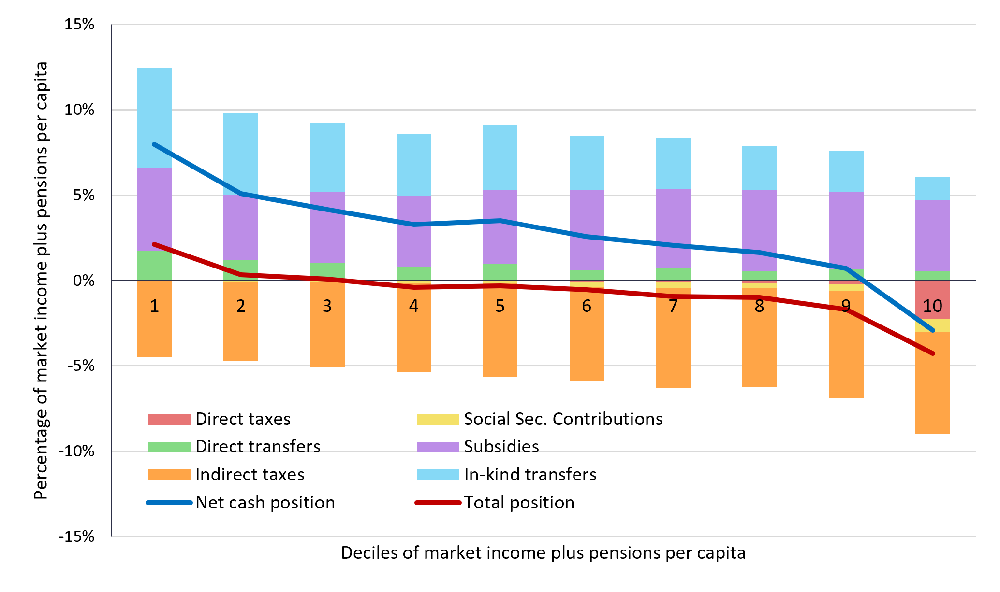

<!-- 

IDEAS TO BE IMPLEMENTED

1/ include map instead of table (include squares for number of poor) >> using geopanda
2/ show multiple years for Summary 
3/ adjust % versus #; and adjust format of numbers #.#
4/ organize country specific elements via a loop (only file_path, Messages annd shapefiles are country specific)
5/ Edit Messages and Text. Consider using boxes for stylized facts
6/ Do we want to include an international comparison

AND: make code more efficient by splitting functions from design
AND: discuss how this can be hosted within WBG infrastructure
AND: set up better folder infrastructure
AND: allow for download of tables and figures
AND: add indicators in fiscal equity (from FIA global database)

PLUS: do we want to facilitate multi year comparison
PLUS: advance text fields for Key Messages and About
PLUS: alignment with PEB and MPO
PLUS: how to create synergies between dashboard and pdf, doc(x)
-->


```{python}

# STEP 1: Import global packages

from pathlib import Path
import base64

import matplotlib.pyplot as plt
import numpy as np
import pandas as pd
from IPython.display import HTML, Markdown

# All data access goes through the loader (afw360/loader.py).
from afw360 import loader
from afw360.format import format_value

INDICATOR_META = loader.load_indicator_meta()


# STEP 2: Table layouts (row label -> series id; column label -> cut code in loader)
# A row spec is a series id, ("ONE_MINUS", series id) for a DERIVED row of
# metadata/plans/LEGACY_LABELS.csv, or None for a row with no series yet.

POVERTY_ROWS = {
    "PL300": {
        "Poverty rate": "POV_HC.POVLINE_PL300.PPP_2021",
        "Number poor (millions)": "POV_NUM.POVLINE_PL300.PPP_2021",
    },
    "PL420": {
        "Poverty rate": "POV_HC.POVLINE_PL420.PPP_2021",
        "Number poor (millions)": "POV_NUM.POVLINE_PL420.PPP_2021",
    },
}
WELFARE_ROWS = {
    "Food consumption share": "CONS_SH.COICOP_CP01",
    "Own-production food consumption": "CONS_SH.COICOP_CP01.ACQ_OWNPROD",
    "Market food consumption": "CONS_SH.COICOP_CP01.ACQ_PURCH",
    "Non-food consumption share": ("ONE_MINUS", "CONS_SH.COICOP_CP01"),
    "Share employed in agriculture": "POP_SH.EMP_SECTOR_AGR",
    "Share employed in industry": "POP_SH.EMP_SECTOR_IND",
    "Share employed in services": "POP_SH.EMP_SECTOR_SER",
}
JOBS_ROWS = {
    "Employment rate": "POP_SH.EMP_STATUS_EMPLOYED",
    "Wage employment rate": "POP_SH.EMP_TYPE_WAGE",
    "Informal wage employment (% of wage)": "POP_SH.EMP_FORMAL_N",
    "Non-wage employment rate": "POP_SH.EMP_TYPE_NONWAGE",
    "Non-agric. enterprise ownership rate": ("ONE_MINUS", "POP_HH_SH.HE_COUNT_0"),
    "Shock exposure rate (any shock, 3 yrs)": "SHK_ANY",
}
AGRI_ROWS = {
    "Agricultural participation rate": "AGR_CULTIVATES",
    "Improved seed use rate": None,
    "Fertilizer use rate": None,
    "Market orientation rate": None,
    "Agricultural mechanisation index": None,
}
ENERGY_ROWS = {
    "Access to electricity (grid or off-grid)": "EN_ELEC_ACCESS",
    "Clean cooking fuel access rate": "EN_COOK_CLEAN",
    "Solid biomass dependency rate": "EN_COOK_BIOMASS",
    "Energy expenditure burden": None,
}
FISCAL_ROWS = {
    "Aggregate impact of fiscal policy (Gini change)": None,
    "Absolute incidence – subsidies": None,
    "Absolute incidence – social spending": None,
    "Absolute incidence – direct taxes": None,
    "Absolute incidence – indirect taxes": None,
}


# STEP 3: Display

TABLE_PROPS = {"font-family": "Calibri, Arial, sans-serif", "font-size": "11pt", "text-align": "center"}
TABLE_STYLES = [{
    "selector": "th",
    "props": [("font-size", "11pt"), ("text-align", "center"), ("background-color", "#f2f2f2")],
}]


def format_table(table, rows):
    """Style a layout table; each row follows its indicator's display_as and decimals."""
    styler = table.style
    for label, spec in rows.items():
        display_as, decimals = loader.display_rule(spec, INDICATOR_META)
        styler = styler.format(
            lambda v, a=display_as, d=decimals: format_value(v, a, d),
            subset=pd.IndexSlice[[label], :],
        )
    return styler.set_properties(**TABLE_PROPS).set_table_styles(TABLE_STYLES)


def show_table(data, rows, columns):
    """Layout table of ``rows`` x ``columns`` built from the SDMX-CSV observations."""
    return format_table(loader.layout_table(data, rows, columns), rows)


def show_message(messages, order):
    """Body of one key message (content/TEXT.csv, slot ``messages``)."""
    body = messages.loc[messages["order"] == order, "body"].iloc[0]
    return Markdown(f"<span style='font-size:16px;'>{body}</span>")


def data_download_button(iso3, label="Download data (SDMX-CSV)"):
    """Raw-HTML button that downloads the country's SDMX-CSV observation file."""
    path = loader.data_path(iso3)
    b64 = base64.b64encode(path.read_bytes()).decode()
    return f"""
<a href="data:text/csv;base64,{b64}" download="{path.name}">
    <button style="background-color:#1F4E78; color:white; padding:8px 12px; border:none;
                   border-radius:5px; font-size:14px; cursor:pointer;">
        {label}
    </button>
</a>
"""


# STEP 4: Legacy layouts, read by the Guinea-Bissau section until it switches
# to the loader (WP9c). It still reads the Senegal legacy tables, as before.

file_path = loader.legacy_table_path("SEN")

group_map_Profile = {
    "estimateTotal": "Total",
    "estimateFemale_HH": "Female",
    "estimateMale_HH": "Male",
    "estimateYouth_HH": "Youth",
    "estimateOlder_HH": "29+", "estimateQ1" : "Q1", "estimateQ2" : "Q2", "estimateQ3" : "Q3", "estimateQ4" : "Q4",	"estimateQ5" : "Q5",
    "estimateRural": "Rural",
    "estimateCapital": "Capital",
    "estimateOther_Urban": "Other Urban"
}
col_order_Profile =  ["Total", "Female", "Male", "Youth", "29+", "Q1", "Q2", "Q3", "Q4", "Q5", "Rural", "Capital", "Other Urban"]

indicator_map_Welfare = {
    "Food consumption share": "Food consumption share",
    "Own-production food share (% total cons.)": "Own-production food consumption",
    "Market food share (% total cons.)": "Market food consumption",
    "Non-food consumption share": "Non-food consumption share",
    "Employed in agriculture (% of employed)": "Share employed in agriculture",
    "Employed in industry (% of employed)": "Share employed in industry",
    "Employed in services (% of employed)": "Share employed in services"
}
row_order_Welfare = list(WELFARE_ROWS)

indicator_map_Jobs = {
    "Employed (activ12m, 15–64)": "Employment rate",
    "Wage-employed (% of employed)": "Wage employment rate",
    "Share of HH workers informally employed": "Informal wage employment (% of wage)",
    "Non-wage employed (% of employed)": "Non-wage employment rate",
    "HH owns a non-agric enterprise": "Non-agric. enterprise ownership rate",
    "Exposed to any shock (past 3 years)": "Shock exposure rate (any shock, 3 yrs)"
}
row_order_Jobs = list(JOBS_ROWS)

indicator_map_Agri = {
    "HH cultivates agricultural land (superf > 0)": "Agricultural participation rate"
}
row_order_Agri = list(AGRI_ROWS)

indicator_map_Energy = {
    "Access to electricity (grid, SDG 7.1.1)": "Access to electricity (grid or off-grid)",
    "Primary cooking fuel clean (gas/electricity)": "Clean cooking fuel access rate",
    "Primary cooking fuel biomass (wood/charcoal)": "Solid biomass dependency rate"
}
row_order_Energy = list(ENERGY_ROWS)


def style_table(table):
    return (
        table.style
        .format("{:.0%}")  # show percentages in format %.%
        .set_properties(**TABLE_PROPS)
        .set_table_styles(TABLE_STYLES)
    )
```


# Senegal

```{python}
ISO3 = "SEN"
data = loader.load_data(ISO3)
messages = loader.load_text(ISO3, "messages")
geo_list = loader.load_codelist("GEO")
geo_list = geo_list[geo_list["ref_area"] == ISO3].set_index("code")
```

## Row Messages {height=10%}

```{python}
#| title: <b>Poverty Patterns and Trends</b>
show_message(messages, 1)
```

```{python}
#| title: <b>Drivers of Inequality</b>
show_message(messages, 2)
```

```{python}
#| title: <b>Constraints to Inclusive Growth</b>
show_message(messages, 3)
```


## Row International Poverty {height=5%}

```{python}
#| title: International Poverty Rate - $3.00/day PPP 2021
show_table(data, POVERTY_ROWS["PL300"], loader.AREA_COLUMNS)
```


```{python}
#| title: Lower Middle Income Poverty Rate - $4.20/day PPP 2021
show_table(data, POVERTY_ROWS["PL420"], loader.AREA_COLUMNS)
```

## Row Figures and Maps {height=10%}

```{python}
#| title: Poverty by Region - $4.20/day (2021 PPP)

map_series = "POV_HC.POVLINE_PL420.PPP_2021"
display_as, decimals = loader.display_rule(map_series, INDICATOR_META)

# Boundaries and observations join on CL_GEO codes
gdf_map = loader.load_boundaries(ISO3, "adm1").merge(
    loader.geo_values(data, map_series).rename("value"),
    left_on="GEO", right_index=True, how="left",
)

fig, ax = plt.subplots(1, 1, figsize=(10, 10))
gdf_map.plot(column="value", cmap="Reds", linewidth=0.8, edgecolor="black", legend=False, ax=ax)

# Add labels for each polygon
for _, row in gdf_map.iterrows():
    centroid = row.geometry.centroid
    ax.annotate(
        text=format_value(row["value"], display_as, decimals),
        xy=(centroid.x, centroid.y),
        ha="center", va="center", fontsize=9, fontweight="bold", color="black",
    )

ax.set_title("Senegal – Poverty at $4.20/day (2021 PPP), ADM1 level")
ax.axis("off")
plt.tight_layout()
plt.show();
```

```{python}
#| title: Poverty by Agro-Ecological Zone ($4.20/day (2021 PPP))

zones = geo_list.index[geo_list["scheme"] == "ZONES"]
plot_df = (
    loader.geo_values(data, "POV_HC.POVLINE_PL420.PPP_2021")
    .reindex(zones)
    .rename("Value")
    .to_frame()
)
plot_df["Location"] = geo_list.loc[plot_df.index, "name_en"].str.split(" (TBD", regex=False).str[0]
plot_df = plot_df.sort_values(by="Value", ascending=True)

plt.figure(figsize=(10, 6))
plt.barh(plot_df["Location"], plot_df["Value"], color="orange")
plt.grid(axis="x", linestyle="--", alpha=0.7)
plt.tight_layout()
plt.show()
```


## Row Profile {height=10%}

### Column {.tabset}

```{python}
#| title: Consumption and Income
show_table(data, WELFARE_ROWS, loader.PROFILE_COLUMNS)
```


```{python}
#| title: Jobs
show_table(data, JOBS_ROWS, loader.PROFILE_COLUMNS)
```


```{python}
#| title: Agriculture
show_table(data, AGRI_ROWS, loader.PROFILE_COLUMNS)
```


```{python}
#| title: Energy
show_table(data, ENERGY_ROWS, loader.PROFILE_COLUMNS)
```

```{python}
#| title: Fiscal Equity
show_table(data, FISCAL_ROWS, {"Total": "_T"})
```


## Fiscal Equity {height=10%}

```{python}
#| output: asis
fig_row = loader.load_figures(ISO3).set_index("figure_id").loc["SEN_FISCAL_EQUITY"]
fig_src = Path(fig_row["path"]).relative_to(loader.ROOT).as_posix()
cards = [
    ("Fiscal Equity I - Who pays & Who receives", "relative"),
    ("Fiscal Equity II - Who pays & Who receives", "absolute"),
]
for title, kind in cards:
    print(f"""
::: {{.card}}
## {title}

{{width=100% fig-alt="{fig_row['alt_text_en']}"}}
_Note: The figure shows the {kind} incidence of taxes, transfers, and subsidies across the welfare distribution. Source: CEQ/GamSim simulations based on EHCVM._
:::
""")
```


## Row About Data {height=10%}

```{python}
#| title: Data and Methodology
#| output: asis

about = loader.load_text(ISO3, "about")["body"].iloc[0]
fence = "`" * 3  # a literal fence line would end this chunk
print(f"""
::: {{style="border:1px solid #d9d9d9; border-radius:8px; padding:15px; background-color:#f8f9fa; font-family:Calibri, Arial, sans-serif; font-size:12pt;"}}
{about}
:::

{fence}{{=html}}
{data_download_button(ISO3)}
{fence}
""")
```


# Guinea Bissau


## Row Messages {height=10%}

```{python}
#| title: <b>Poverty Patterns and Trends</b>
Markdown("<span style='font-size:16px;'>TEXT</span>")
```

```{python}
#| title: <b>Drivers of Inequality</b>
Markdown("<span style='font-size:16px;'> TEXT</span>")
```

```{python}
#| title: <b>Constraints to Inclusive Growth</b>
Markdown("<span style='font-size:16px;'>TEXT</span>")
```


## Row International Poverty {height=5%}

```{python}
#| title: International Poverty Rate - $3.00/day PPP 2021

# Read the National sheet
df = pd.read_excel(file_path, sheet_name="National")

# Define the indicators to extract
indicators = {
    "Poor at $3.00/day (2021 PPP)": "Poverty rate",
    "Number poor $3.00/day (millions)": "Number poor (millions)"
}

# Define the geographic columns to keep
geo_cols = {
    "estimateTotal": "Total",
    "estimateCapital": "Capital",
    "estimateOther_Urban": "Other urban",
    "estimateRural": "Rural"
}

# Filter to selected indicators and columns
table = (
    df[df["indicator"].isin(indicators.keys())]
    .loc[:, ["indicator"] + list(geo_cols.keys())]
    .copy()
)

# Rename rows and columns
table["indicator"] = table["indicator"].map(indicators)
table = table.rename(columns=geo_cols)

# Set indicator as row index
table = table.set_index("indicator")

# Optional: reorder rows
row_order = [
    "Poverty rate",
    "Number poor (millions)"
]

table = table.loc[row_order]

# Optional: reorder columns
table = table[["Total", "Capital", "Other urban", "Rural"]]

# Convert poverty rates to percent
table_formatted = table.copy()
rate_rows = table_formatted.index.str.contains("Poverty rate")

# Apply to your table
table_formatted.loc[rate_rows] = table_formatted.loc[rate_rows]
table_formatted = table_formatted.round(1)
styled_table = style_table(table_formatted)
styled_table
```


```{python}
#| title: Lower Middle Income Poverty Rate - $4.20/day PPP 2021

# Read the National sheet
df = pd.read_excel(file_path, sheet_name="National")

# Define the indicators to extract
indicators = {
    "Poor at $4.20/day (2021 PPP)": "Poverty rate",
    "Number poor $4.20/day (millions)": "Number poor (millions)"
}

# Define the geographic columns to keep
geo_cols = {
    "estimateTotal": "Total",
    "estimateCapital": "Capital",
    "estimateOther_Urban": "Other urban",
    "estimateRural": "Rural"
}

# Filter to selected indicators and columns
table = (
    df[df["indicator"].isin(indicators.keys())]
    .loc[:, ["indicator"] + list(geo_cols.keys())]
    .copy()
)

# Rename rows and columns
table["indicator"] = table["indicator"].map(indicators)
table = table.rename(columns=geo_cols)

# Set indicator as row index
table = table.set_index("indicator")

# Optional: reorder rows
row_order = [
    "Poverty rate",
    "Number poor (millions)"
]

table = table.loc[row_order]

# Optional: reorder columns
table = table[["Total", "Capital", "Other urban", "Rural"]]

# Convert poverty rates to percent
table_formatted = table.copy()
rate_rows = table_formatted.index.str.contains("Poverty rate")

# Apply to your table
table_formatted.loc[rate_rows] = table_formatted.loc[rate_rows]
table_formatted = table_formatted.round(1)
styled_table = style_table(table_formatted)
styled_table
```


## Row Figures and Maps {height=10%}

```{python}
#| title: Poverty by Region - $3.00/day (2021 PPP)

# Load Excel file and ADM 1 sheet
df = pd.read_excel(file_path, sheet_name="ADM 1")

# Select the row for the indicator of interest
row = df[df["indicator"] == "Poor at $3.00/day (2021 PPP)"]

# Extract location columns (all columns except 'indicator')
values = row.drop(columns=["indicator"]).iloc[0]

# Clean location names (remove 'estimate' prefix)
values.index = values.index.str.replace("estimate", "")

# Convert to DataFrame for plotting
plot_df = values.reset_index()
plot_df.columns = ["Location", "Value"]

# Sort values for better visualization
plot_df = plot_df.sort_values(by="Value", ascending=True)

# Create horizontal bar chart
plt.figure(figsize=(10, 6))
plt.barh(plot_df["Location"], plot_df["Value"], color="steelblue")
plt.grid(axis="x", linestyle="--", alpha=0.7)
plt.tight_layout()

plt.show()
```

```{python}
#| title: Poverty by Agro-Ecological Zone - $3.00/day (2021 PPP)

# Load Excel file and ZAE sheet
df = pd.read_excel(file_path, sheet_name="ZAE")

# Select the row for the indicator of interest
row = df[df["indicator"] == "Poor at $3.00/day (2021 PPP)"]

# Extract location columns (all columns except 'indicator')
values = row.drop(columns=["indicator"]).iloc[0]

# Clean location names (remove 'estimate' prefix)
values.index = values.index.str.replace("estimate", "")

# Convert to DataFrame for plotting
plot_df = values.reset_index()
plot_df.columns = ["Location", "Value"]

# Sort values for better visualization
plot_df = plot_df.sort_values(by="Value", ascending=True)

# Create horizontal bar chart
plt.figure(figsize=(10, 6))
plt.barh(plot_df["Location"], plot_df["Value"], color="orange")
plt.grid(axis="x", linestyle="--", alpha=0.7)
plt.tight_layout()

plt.show()
```

## Row Profile {height=10%}

### Column {.tabset}

```{python}
#| title: Consumption and Income

# Load Excel file
df = pd.read_excel(file_path, sheet_name="National")

# Filter to selected welfare indicators
table = (
    df[df["indicator"].isin(indicator_map_Welfare.keys())]
    .loc[:, ["indicator"] + list(group_map_Profile.keys())]
    .copy()
)

# Rename rows and columns
table["indicator"] = table["indicator"].map(indicator_map_Welfare)
table = table.rename(columns=group_map_Profile)

# Set indicators as rows
table = table.set_index("indicator")

# Apply to your table
table = table.loc[row_order_Welfare, col_order_Profile]
table_formatted = (table).round(1)
styled_table = style_table(table_formatted)
styled_table
```


```{python}
#| title: Jobs

# Load Excel file
df = pd.read_excel(file_path, sheet_name="National")

# Filter to selected welfare indicators
table = (
    df[df["indicator"].isin(indicator_map_Jobs.keys())]
    .loc[:, ["indicator"] + list(group_map_Profile.keys())]
    .copy()
)

# Rename rows and columns
table["indicator"] = table["indicator"].map(indicator_map_Jobs)
table = table.rename(columns=group_map_Profile)

# Set indicators as rows
table = table.set_index("indicator")

# Apply to your table
table = table.loc[row_order_Jobs, col_order_Profile]
table_formatted = (table).round(1)
styled_table = style_table(table_formatted)
styled_table
```


```{python}
#| title: Agriculture

# Load Excel file
df = pd.read_excel(file_path, sheet_name="National")

# Filter available indicators
table = (
    df[df["indicator"].isin(indicator_map_Agri.keys())]
    .loc[:, ["indicator"] + list(group_map_Profile.keys())]
    .copy()
)

# Rename
table["indicator"] = table["indicator"].map(indicator_map_Agri)
table = table.rename(columns=group_map_Profile)

# Set rows
table = table.set_index("indicator")

# Add missing rows explicitly (as NaN placeholders)
missing_rows = [
    "Improved seed use rate",
    "Fertilizer use rate",
    "Market orientation rate",
    "Agricultural mechanisation index"
]

for row in missing_rows:
    table.loc[row] = pd.NA

# Apply to your table
table = table.loc[row_order_Agri, col_order_Profile]
table_formatted = (table).round(1)
styled_table = style_table(table_formatted)
styled_table
```


```{python}
#| title: Energy

# Load Excel file
df = pd.read_excel(file_path, sheet_name="National")

# Filter available indicators
table = (
    df[df["indicator"].isin(indicator_map_Energy.keys())]
    .loc[:, ["indicator"] + list(group_map_Profile.keys())]
    .copy()
)

# Rename rows and columns
table["indicator"] = table["indicator"].map(indicator_map_Energy)
table = table.rename(columns=group_map_Profile)

# Set row index
table = table.set_index("indicator")

# Add missing row (not available in National sheet)
table.loc["Energy expenditure burden"] = pd.NA

# Apply to your table
table = table.loc[row_order_Energy, col_order_Profile]
table_formatted = (table).round(1)
styled_table = style_table(table_formatted)
styled_table
```


```{python}
#| title: Fiscal Equity

# Load Excel file
df = pd.read_excel(file_path, sheet_name="National")

group_map_ProfileFiscal = {
    "estimateTotal": "Total"
}
col_order_ProfileFiscal =  ["Total"]

indicator_map_Fiscal = {
    "Aggregate impact of fiscal policy (Gini change)": "Aggregate impact of fiscal policy (Gini change)",
    "Absolute incidence – subsidies": "Absolute incidence – subsidies",
    "Absolute incidence – social spending": "Absolute incidence – social spending",
    "Absolute incidence – direct taxes": "Absolute incidence – direct taxes",
    "Absolute incidence – indirect taxes": "Absolute incidence – indirect taxes"
}

row_order_Fiscal = [
    "Aggregate impact of fiscal policy (Gini change)",
    "Absolute incidence – subsidies",
    "Absolute incidence – social spending",
    "Absolute incidence – direct taxes",
    "Absolute incidence – indirect taxes"
]


# Filter available indicators
table = (
    df[df["indicator"].isin(indicator_map_Fiscal.keys())]
    .loc[:, ["indicator"] + list(group_map_ProfileFiscal.keys())]
    .copy()
)

# Rename rows and columns
table["indicator"] = table["indicator"].map(indicator_map_Fiscal)
table = table.rename(columns=group_map_ProfileFiscal)

# Set row index
table = table.set_index("indicator")

# Add missing row (not available in National sheet)
table.loc["Aggregate impact of fiscal policy (Gini change)"] = pd.NA
table.loc["Absolute incidence – subsidies"] = pd.NA
table.loc["Absolute incidence – social spending"] = pd.NA
table.loc["Absolute incidence – direct taxes"] = pd.NA
table.loc["Absolute incidence – indirect taxes"] = pd.NA

# Apply to your table
table = table.loc[row_order_Fiscal, col_order_ProfileFiscal]
table_formatted = (table).round(1)
styled_table = style_table(table_formatted)
styled_table
```


## Fiscal Equity {height=10%}

::: {.card}
## Fiscal Equity I - Who pays & Who receives

{width=100%}
_Note: The figure shows the relative incidence of taxes, transfers, and subsidies across the welfare distribution. Source: CEQ/GamSim simulations based on EHCVM._
:::

::: {.card}
## Fiscal Equity II - Who pays & Who receives

{width=100%}
_Note: The figure shows the absolute incidence of taxes, transfers, and subsidies across the welfare distribution. Source: CEQ/GamSim simulations based on EHCVM._
:::


## Row About Data {height=10%}

```{python}
#| title: Data and Methodology

text = Path("data_raw/text/About_GNB.txt").read_text(encoding="utf-8")

HTML(f"""
<div style="
    border:1px solid #d9d9d9;
    border-radius:8px;
    padding:15px;
    background-color:#f8f9fa;
    font-family:Calibri, Arial, sans-serif;
    font-size:12pt;
">
{text}
</div>
""")


from IPython.display import HTML
import base64

file_name = "data_raw/tables/Tables_GNB.xlsx"

with open(file_name, "rb") as f:
    b64 = base64.b64encode(f.read()).decode()

HTML(f"""
<a href="data:application/vnd.openxmlformats-officedocument.spreadsheetml.sheet;base64,{b64}"
   download="{file_name}">
    <button style="
        background-color:#1F4E78;
        color:white;
        padding:8px 12px;
        border:none;
        border-radius:5px;
        font-size:14px;
        cursor:pointer;
    ">
        Download Summary Tables
    </button>
</a>
""")
```


# About

```{python}
#| title: Key Messages

text = Path("data_raw/text/About.txt").read_text(encoding="utf-8")

HTML(f"""
<div style="
    border:1px solid #d9d9d9;
    border-radius:8px;
    padding:15px;
    background-color:#f8f9fa;
    font-family:Calibri, Arial, sans-serif;
    font-size:12pt;
">
{text}
</div>
""")
```